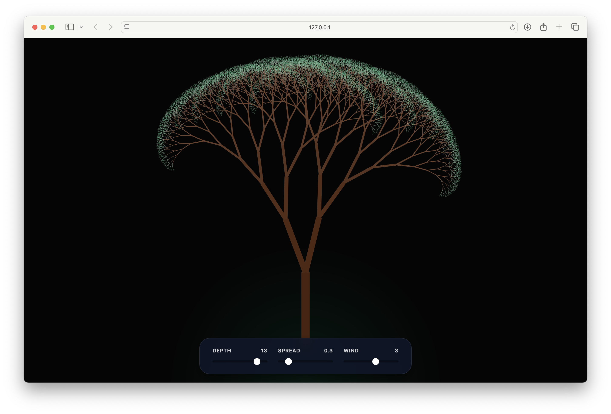

# Fractal Tree Animation

Animated fractal tree renderer built on the HTML5 Canvas API. Recursive branching with real-time wind simulation and interactive controls.

**[Live Demo →](https://h4jwm4.github.io/fractal-tree-animation/)**


---

## Features

- Recursive binary tree up to 15 levels deep
- Sinusoidal wind simulation per branch depth
- HiDPI / Retina canvas rendering
- Responsive — redraws on window resize
- Zero dependencies, single HTML file

## Controls

| Slider | Range | Description |
|--------|-------|-------------|
| Depth | 1 – 15 | Recursion depth. Higher = more branches, heavier render |
| Spread | 0.1 – 1.5 | Angle (radians) between child branches |
| Wind | 0 – 5 | Amplitude of the sway oscillation |

## How it works

The tree is drawn recursively. Each call translates the canvas origin to the end of the current branch, rotates by the given angle, and draws the next segment at 75% of the parent's length.

```
drawTree(x, y, len, angle, width, depth)
  ├── draw segment from (x,y) in direction angle
  ├── drawTree(tip, len * 0.75, +spread + sway, width * 0.7, depth - 1)
  └── drawTree(tip, len * 0.75, -spread + sway, width * 0.7, depth - 1)
```

Wind is applied as a sine wave offset keyed to `time` and `depth`, so inner branches sway less than outer ones.

Branch color shifts from green tones near the tips to dark browns at the trunk based on remaining depth.

## Performance

Depth 13 renders ~8,000 branches per frame at 60 fps on modern hardware. Pushing to 15 draws ~32,000 — expect slowdown on low-end devices.

## License

MIT